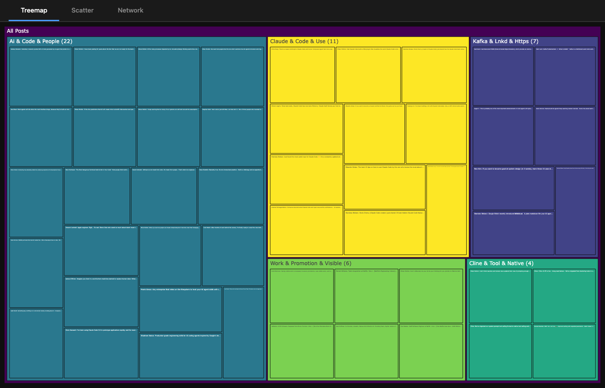
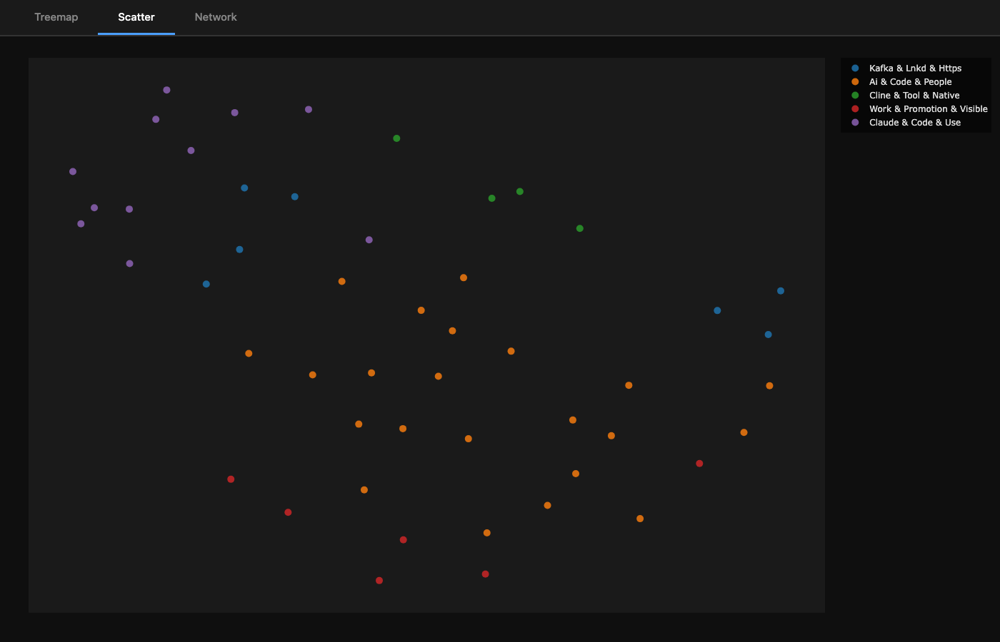
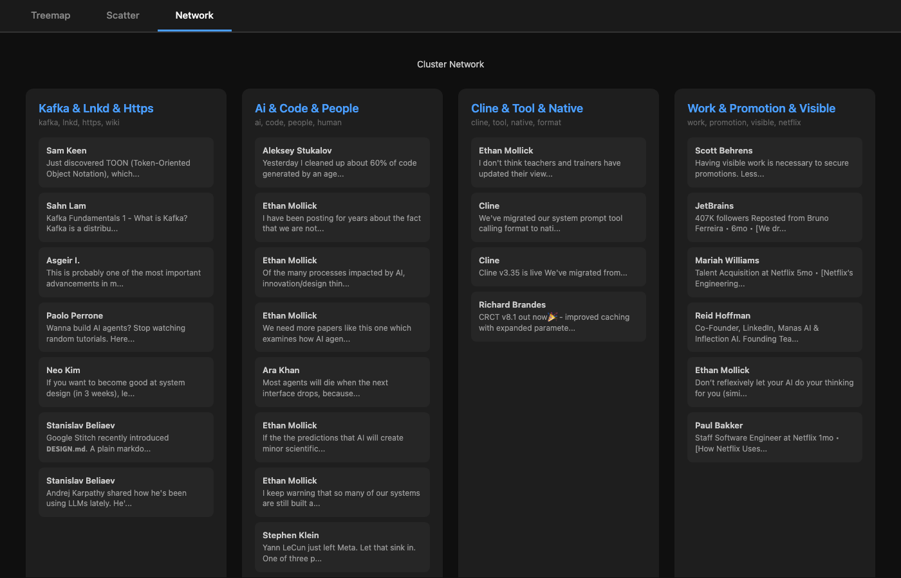

# DigIn

Scrape, cluster, and visualize your LinkedIn saved posts.

DigIn transforms your LinkedIn saved posts from a disorganized pile into clustered, searchable, exportable knowledge. It uses ML-powered topic detection to automatically group related posts together.







## Features

- **Sync** saved posts from LinkedIn via browser automation
- **Cluster** posts by topic using sentence embeddings + K-means
- **Visualize** clusters with interactive treemap, scatter, and network views
- **Export** to CSV, JSON, or Markdown
- **Agent-friendly** — `--json` flag on every command, `schema` for tool discovery
- **Resumable** — only fetches new posts on re-sync
- **Headless** — runs without a visible browser after first login
- **Offline clustering** — no network needed after initial model download
- **Claude Code plugin** — clone the repo and get a workflow skill automatically

## Install

```bash
git clone https://github.com/nowucca/digin.git
cd digin
uv sync
uv run playwright install chromium
```

## Quick Start

```bash
# First run: opens browser for LinkedIn login
digin sync

# Cluster posts by topic
digin cluster

# View results
digin show                    # Summary table
digin show -c 1               # Posts in cluster 1

# Visualize
digin viz                     # Interactive HTML visualization

# Export
digin export -f json          # JSON to stdout
digin export -f csv -o data.csv
digin export -f md -o research.md
```

## Commands

| Command | Description |
|---------|-------------|
| `digin sync` | Fetch saved posts from LinkedIn |
| `digin cluster` | Group posts into topic clusters |
| `digin show` | Display cluster summary or detail |
| `digin viz` | Interactive HTML visualization |
| `digin export` | Export to CSV, JSON, or Markdown |
| `digin status` | Show database and cluster status |
| `digin schema` | Output full command schema as JSON |
| `digin skill install` | Install Claude Code skill |

## Agent Integration

DigIn is designed to be used by AI agents. Every command supports a `--json` flag for structured output:

```bash
digin --json status          # JSON status with paths, counts, clusters
digin --json show            # JSON cluster summary
digin --json show -c 1       # JSON posts in cluster 1
digin --json cluster         # JSON cluster results
```

Agents can discover all commands programmatically:

```bash
digin schema                 # Full JSON: commands, options, types, workflow
digin schema | jq '.commands[].name'
```

### Claude Code Plugin

This repo is a Claude Code plugin. After cloning, the `digin-workflow` skill is automatically available and guides you through the full workflow. You can also install the skill globally:

```bash
digin skill install          # Install to ~/.claude/skills/digin/
```

## How It Works

1. **Sync**: Playwright launches Chrome, you log in to LinkedIn (first time only), and DigIn scrolls through your saved posts extracting content, authors, and links. Each post is enriched by visiting its detail page for full text and external URLs. Sessions persist — subsequent syncs can run headless.

2. **Cluster**: Posts are converted to 384-dimensional vectors using [sentence-transformers](https://www.sbert.net/) (`all-MiniLM-L6-v2`), then grouped via K-means. The optimal number of clusters is auto-detected using silhouette scoring. Each cluster gets TF-IDF keywords.

3. **Visualize**: Three interactive views in a single HTML page:
   - **Treemap** — proportional blocks sized by cluster, click to drill down
   - **Scatter** — UMAP 2D projection showing topic proximity
   - **Network** — card layout grouped by cluster, click to open posts

### Architecture: Local ML, No LLMs

By design, DigIn runs entirely locally with no API calls or cloud dependencies after initial setup. The ML stack:

| Component | What | Role |
|-----------|------|------|
| [all-MiniLM-L6-v2](https://huggingface.co/sentence-transformers/all-MiniLM-L6-v2) | Pre-trained sentence encoder (80MB, downloaded once) | Converts post text → 384-dim vectors |
| [K-means](https://scikit-learn.org/stable/modules/generated/sklearn.cluster.KMeans.html) | Classical clustering algorithm | Groups vectors by proximity |
| [TF-IDF](https://scikit-learn.org/stable/modules/generated/sklearn.feature_extraction.text.TfidfVectorizer.html) | Statistical keyword extraction | Finds distinctive terms per cluster |
| [UMAP](https://umap-learn.readthedocs.io/) | Dimensionality reduction | Compresses 384-dim → 2D for scatter plot |
| [Silhouette scoring](https://scikit-learn.org/stable/modules/generated/sklearn.metrics.silhouette_score.html) | Cluster quality metric | Auto-detects optimal number of clusters |

No generative AI, no token costs, no network required after the first model download. Everything runs offline.

## Configuration

Optional config file at `$XDG_CONFIG_HOME/digin/config.yaml`:

```yaml
linkedin:
  headless: false
  scroll_delay: 2

clustering:
  method: kmeans
  min_cluster_size: 3

output:
  default_format: table
```

## Data Storage

Uses XDG-compliant directories:

| What | Location |
|------|----------|
| Config | `~/.config/digin/config.yaml` |
| Database | `~/.local/share/digin/digin.db` |
| Browser cache | `~/.cache/digin/browser-data/` |

## Development

```bash
# Run tests (74 tests, 100% coverage excluding scraper)
uv run pytest

# Run with coverage
uv run pytest --cov=digin --cov-branch

# Run a specific test
uv run pytest tests/test_cli.py::test_full_pipeline -v
```

## Roadmap

- **LLM-powered cluster naming** — Use Claude API to generate meaningful cluster summaries instead of top TF-IDF keywords (e.g., "AI Agent Frameworks" instead of "Ai & Code & Agent")
- **Research pipeline** (`digin explore`) — Follow links in posts, summarize referenced content, surface deeper insights using Claude
- **HDBSCAN clustering** — Density-based clustering that handles noise and finds natural cluster shapes without specifying K
- **Incremental clustering** — Add new posts to existing clusters without re-clustering everything
- **Engagement extraction** — LinkedIn's saved posts view doesn't expose like/comment counts; scrape from detail pages

## License

MIT
