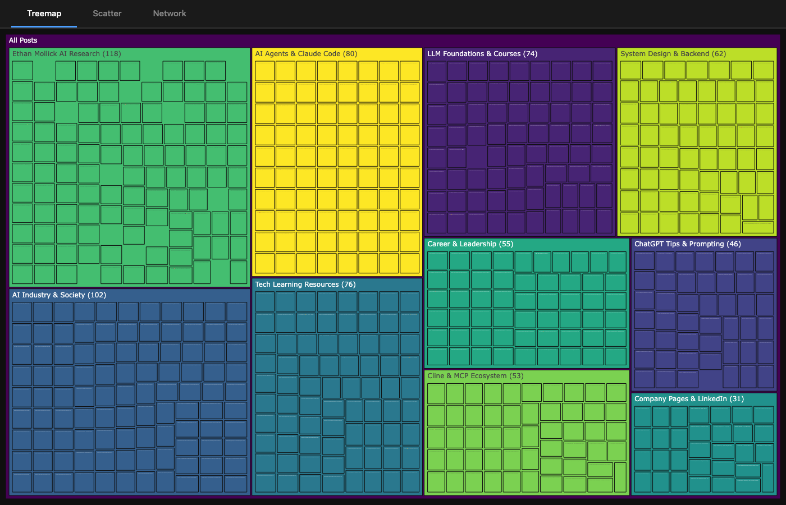
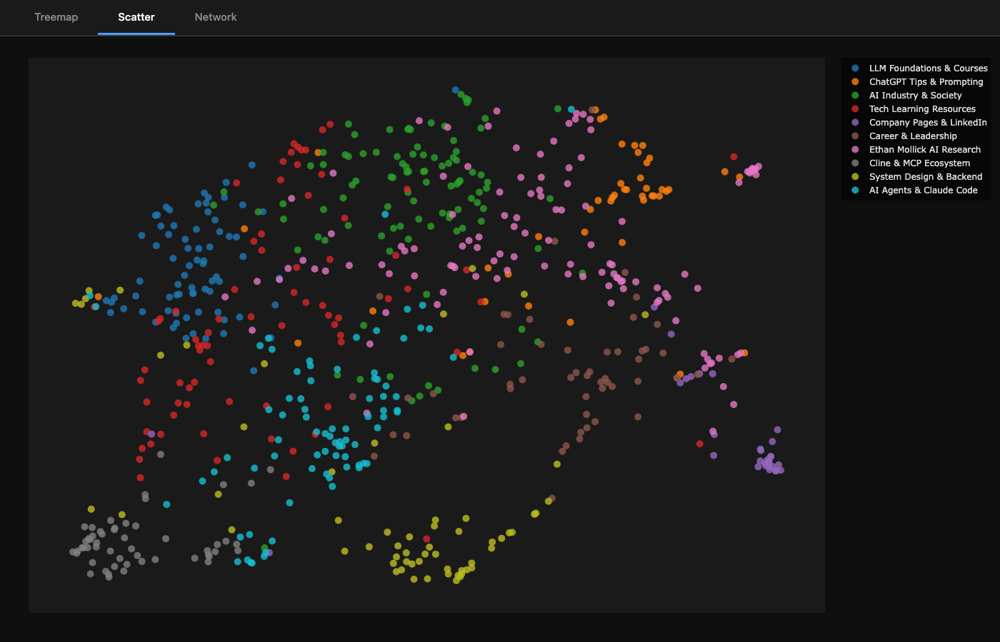
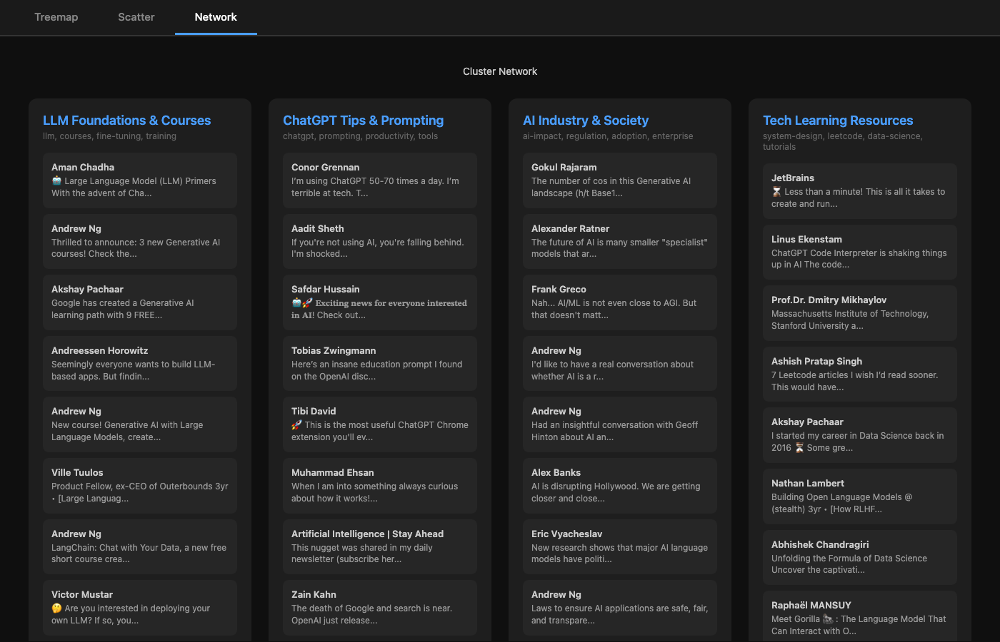

# DigIn

Scrape, cluster, and visualize your LinkedIn saved posts.

DigIn transforms your LinkedIn saved posts from a disorganized pile into clustered, searchable, exportable knowledge. It uses Claude to intelligently group related posts by topic.







## Features

- **Cluster with Claude** — intelligent topic detection with meaningful names (default)
- **Sync** saved posts from LinkedIn via browser automation
- **Visualize** clusters with interactive treemap, scatter, and network views
- **Export** to CSV, JSON, or Markdown
- **Local fallback** — offline K-means clustering when no API key is available
- **Agent-friendly** — `--json` flag on every command, `schema` for tool discovery
- **Resumable** — only fetches new posts on re-sync
- **Headless** — runs without a visible browser after first login
- **Claude Code plugin** — clone the repo and get a workflow skill automatically

## Install

```bash
git clone https://github.com/nowucca/digin.git
cd digin
uv sync
uv run playwright install chromium

# For Claude-powered clustering (recommended):
export ANTHROPIC_API_KEY=sk-ant-...
```

## Quick Start

```bash
# First run: opens browser for LinkedIn login
digin sync

# Cluster posts by topic (uses Claude API)
digin cluster

# View results
digin show                    # Summary table
digin show -c 1               # Posts in cluster 1

# Visualize
digin viz                     # Interactive HTML visualization

# Export
digin export -f json          # JSON to stdout
digin export -f csv -o data.csv
digin export -f md -o research.md
```

## Commands

| Command | Description |
|---------|-------------|
| `digin sync` | Fetch saved posts from LinkedIn |
| `digin cluster` | Cluster posts with Claude (default) or local ML (`--local`) |
| `digin show` | Display cluster summary or detail |
| `digin viz` | Interactive HTML visualization |
| `digin export` | Export to CSV, JSON, or Markdown |
| `digin status` | Show database and cluster status |
| `digin schema` | Output full command schema as JSON |
| `digin skill install` | Install Claude Code skill |

## Clustering

### Claude-Powered (Default)

```bash
digin cluster                 # Uses Claude API
```

Sends post previews to Claude Sonnet, which identifies natural topic groups and assigns meaningful names. Requires `ANTHROPIC_API_KEY` environment variable.

**Example output:**
```
  #  Cluster                    Posts  Keywords
  1  Claude Code & Harnesses       55  claude-code, agents, harnesses
  2  Cline & MCP Ecosystem         60  cline, mcp, context-management
  3  Ethan Mollick AI Research    110  ai-research, education, adoption
  4  System Design & Backend       55  graphql, kafka, api-design
```

### Local ML Fallback

```bash
digin cluster --local         # Offline, no API key needed
digin cluster -k 10           # Force 10 clusters (implies --local)
```

Uses sentence-transformers embeddings + K-means. Fully offline after initial model download. Auto-falls back to this if no API key is set.

## Agent Integration

DigIn is designed to be used by AI agents. Every command supports a `--json` flag for structured output:

```bash
digin --json status          # JSON status with paths, counts, clusters
digin --json show            # JSON cluster summary
digin --json show -c 1       # JSON posts in cluster 1
digin --json cluster         # JSON cluster results
```

Agents can discover all commands programmatically:

```bash
digin schema                 # Full JSON: commands, options, types, workflow
digin schema | jq '.commands[].name'
```

### Claude Code Plugin

This repo is a Claude Code plugin. After cloning, the `digin-workflow` skill is automatically available and guides you through the full workflow. You can also install the skill globally:

```bash
digin skill install          # Install to ~/.claude/skills/digin/
```

## How It Works

1. **Sync**: Playwright launches Chrome, you log in to LinkedIn (first time only), and DigIn scrolls through your saved posts extracting content, authors, and links. Each post is enriched by visiting its detail page for full text and external URLs. Sessions persist — subsequent syncs can run headless.

2. **Cluster**: By default, post previews are sent to Claude which identifies natural topic groups and assigns each post. With `--local`, posts are converted to 384-dimensional vectors using sentence-transformers, then grouped via K-means with auto-K selection.

3. **Visualize**: Three interactive views in a single HTML page:
   - **Treemap** — proportional blocks sized by cluster, click to drill down
   - **Scatter** — UMAP 2D projection showing topic proximity
   - **Network** — card layout grouped by cluster, click to open posts

### Architecture

| Component | What | When |
|-----------|------|------|
| [Claude Sonnet](https://docs.anthropic.com/) | LLM-powered clustering | Default mode (`digin cluster`) |
| [all-MiniLM-L6-v2](https://huggingface.co/sentence-transformers/all-MiniLM-L6-v2) | Sentence embeddings (80MB) | Local mode (`--local`) |
| [K-means](https://scikit-learn.org/stable/modules/generated/sklearn.cluster.KMeans.html) | Clustering algorithm | Local mode |
| [TF-IDF](https://scikit-learn.org/stable/modules/generated/sklearn.feature_extraction.text.TfidfVectorizer.html) | Keyword extraction | Local mode |
| [UMAP](https://umap-learn.readthedocs.io/) | 2D projection | Visualization scatter plot |
| [Plotly](https://plotly.com/python/) | Interactive charts | Visualization treemap/scatter |

Claude mode requires `ANTHROPIC_API_KEY`. Local mode runs fully offline after initial model download.

## Configuration

Optional config file at `$XDG_CONFIG_HOME/digin/config.yaml`:

```yaml
linkedin:
  headless: false
  scroll_delay: 2

clustering:
  min_cluster_size: 3

output:
  default_format: table
```

## Data Storage

Uses XDG-compliant directories:

| What | Location |
|------|----------|
| Config | `~/.config/digin/config.yaml` |
| Database | `~/.local/share/digin/digin.db` |
| Browser cache | `~/.cache/digin/browser-data/` |

## Development

```bash
# Run tests (74 tests, 100% coverage excluding scraper)
uv run pytest

# Run with coverage
uv run pytest --cov=digin --cov-branch

# Run a specific test
uv run pytest tests/test_cli.py::test_full_pipeline -v
```

## Roadmap

- **Research pipeline** (`digin explore`) — Follow links in posts, summarize referenced content, surface deeper insights using Claude
- **HDBSCAN clustering** — Density-based local clustering that handles noise and finds natural cluster shapes
- **Incremental clustering** — Add new posts to existing clusters without re-clustering everything
- **Engagement extraction** — Scrape like/comment counts from detail pages

## License

MIT
